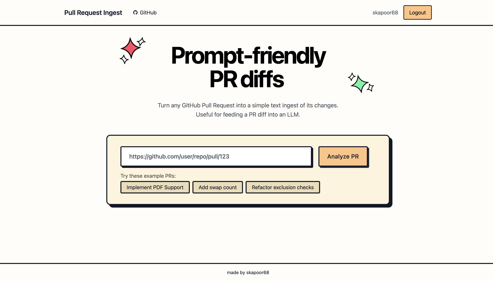
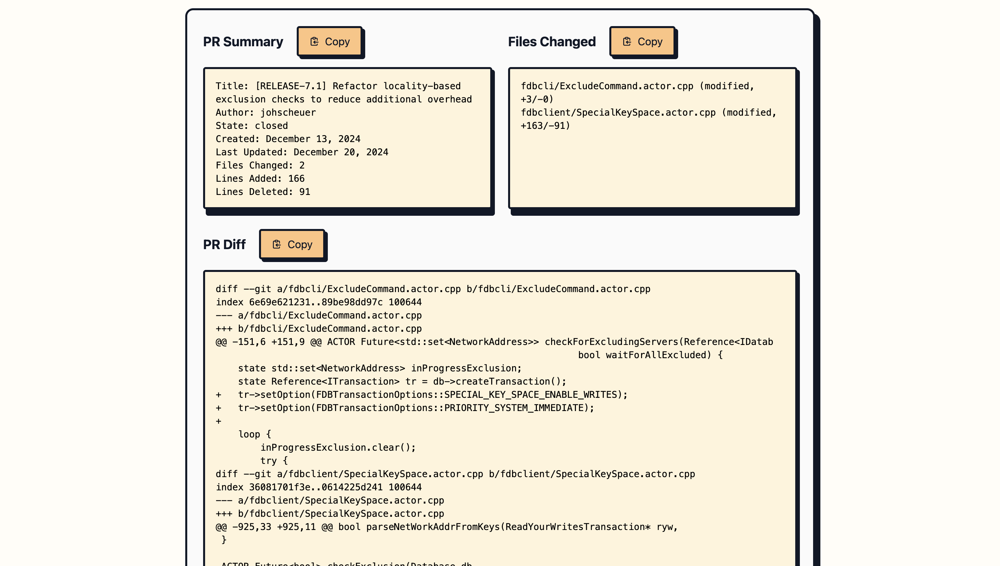

# Pull Request Ingest

Turn any GitHub pull request into a text ingest of changes

Great for feeding PR diffs into an LLM

## Features

- **Complete PR Diffs**: Instantly convert any PR into a complete and unified text diff 
- **Utility**: Get PR summaries and information about files changed
- **Fast Generation**: Powered by GitHub API

## Tech Stack

- **Frontend**: Jinja, Tailwind
- **Backend**: FastAPI, Python
- **Deployment**: Railway

## Self-hosting / Local Development

Coming soon

## Contributing

Contributions are welcome! Feel free to open an issue or submit a pull request.

## Acknowledgements

Credit to [Romain Courtois](https://github.com/cyclotruc)'s [Gitingest](https://gitingest.com/) for inspiration and styling.

## Rate Limits

Users are limited to 10 requests per minute. 

## Future Steps

- Getting a custom domain name
- Adding local development and hosting instructions
- Integrating with [Gitingest](https://gitingest.com/)
